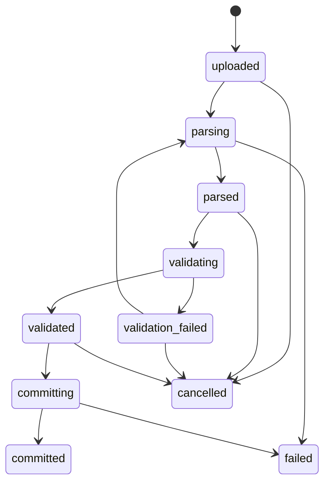

# 取込・検証・再取込仕様

最終更新: 2026-06-15

## 1. import batch 状態遷移

| status | 意味 | 再実行可能操作 |
| --- | --- | --- |
| `uploaded` | raw file 登録済み | parse, cancel |
| `parsing` | parse 中 | なし |
| `parsed` | staging 作成済み | validate, parse rerun, cancel |
| `validating` | validation 中 | なし |
| `validation_failed` | blocking error あり | parse rerun, cancel |
| `validated` | commit 可能 | commit, parse rerun, cancel |
| `committing` | canonical/mart 反映中 | なし |
| `committed` | 反映済み | rollback は別操作 |
| `failed` | 想定外エラー | parse rerun または管理者確認 |
| `cancelled` | ユーザー取消 | なし |

## 2. staging tables

### 2.1 `ingest.staging_rows`

raw 1行ごとの parse 結果を保持する。PII を含む raw 値は private DB とし、API では必要最小限だけ返す。

| column | type | note |
| --- | --- | --- |
| `id` | uuid pk | staging row |
| `batch_id` | uuid | import batch |
| `raw_file_id` | uuid | raw file |
| `raw_row_number` | integer | 1始まり |
| `raw_payload` | jsonb | raw 1行。PII を含む可能性があるため API では原則返さない |
| `parse_status` | text | `parsed`, `warning`, `error` |
| `parse_errors` | jsonb | parse error |
| `created_at` | timestamptz | 作成日時 |

### 2.2 `ingest.staging_canonical_rows`

canonical 変換後の preview/validate 用データ。

| column | type | note |
| --- | --- | --- |
| `id` | uuid pk | staging canonical row |
| `batch_id` | uuid | import batch |
| `raw_row_numbers` | integer[] | 集約元 raw 行 |
| `current_record_key` | text | 現在値 upsert key。正規化済み表示名を含めない |
| `history_record_key` | text | 監査/履歴 key |
| `canonical_payload` | jsonb | canonical 予定値 |
| `target_facility_id` | uuid | facility |
| `target_stay_month` | date | mart refresh 用 |
| `validation_status` | text | `pending`, `valid`, `warning`, `error` |

### 2.3 `ingest.validation_errors`

| column | type | note |
| --- | --- | --- |
| `id` | uuid pk | validation issue |
| `batch_id` | uuid | import batch |
| `severity` | text | `error`, `warning` |
| `code` | text | machine readable code |
| `message` | text | user readable |
| `raw_row_number` | integer | raw 行番号 |
| `canonical_row_id` | uuid | staging canonical row |
| `field_name` | text | 対象 field |

### 2.4 `ingest.import_commits`

| column | type | note |
| --- | --- | --- |
| `id` | uuid pk | commit id |
| `batch_id` | uuid | import batch |
| `committed_by` | uuid | auth user |
| `committed_at` | timestamptz | commit time |
| `affected_facility_ids` | uuid[] | mart refresh 対象 |
| `affected_stay_months` | date[] | mart refresh 対象 |
| `upserted_rows` | integer | canonical upsert 件数 |
| `deleted_rows` | integer | 差替削除件数 |
| `refreshed_marts` | text[] | refresh 済み mart |

## 3. 冪等性と更新ルール

canonical は「現在値」を保持する。更新履歴は raw/staging/import_commits で追えるようにする。

| 用途 | key |
| --- | --- |
| canonical 現在値 | `source_system + facility_id + reservation_key + stay_date + room_type_raw + room_no + stay_night_index` |
| raw/staging 履歴 | `raw_file_id + raw_row_number` |
| PMS 更新日時 | `source_updated_at` |
| raw file 重複検知 | `content_hash + original_file_name + source_system` |

`source_updated_at` は unique key に含めない。同じ予約・同じ泊目が更新された場合は、canonical の現在値を後勝ち upsert する。

`room_type_normalized` と `budget_room_type` は mapping 修正で変わる可能性があるため、`current_record_key` に含めない。raw に部屋番号が無い場合は `room_no = ""` として key を作る。

## 4. ねっぱん集約ルール

ねっぱんは同じ `reservation_key + stay_night_index` に料金内訳行が複数存在する場合がある。

1. `reservation_key = 予約ID + "|" + 予約番号`
2. `stay_date = チェックイン日 + (泊目 - 1日)`
3. `current_record_key = source_system + facility_id + reservation_key + stay_date + room_type_raw + room_no + stay_night_index`
4. 同一 `current_record_key` の raw 行を集約
5. `gross_amount = sum(大人合計額 + 子供合計額 + 幼児合計額 + その他合計額)`
6. `reservation_total_amount = 料金合計額` は検算用
7. 予約単位で `sum(gross_amount)` と `reservation_total_amount` が 1円を超えて違う場合は warning

## 5. validation rules

| code | severity | condition |
| --- | --- | --- |
| `MISSING_REQUIRED_DATE` | error | `stay_date`, `checkin_date`, `checkout_date` が作れない |
| `UNKNOWN_FACILITY` | error | source facility mapping が無い |
| `INVALID_AMOUNT` | error | 金額が数値化できない |
| `INVALID_ROOM_COUNT` | error | `sold_room_nights <= 0` |
| `UNKNOWN_ROOM_TYPE` | warning | room type mapping が無い |
| `UNKNOWN_CHANNEL` | warning | channel mapping が無い |
| `UNKNOWN_COUNTRY` | warning | country mapping が無い |
| `AMOUNT_TOTAL_MISMATCH` | warning | 泊目別合計と予約総額が不一致 |
| `LEAD_TIME_INVALID` | warning | `lead_time_days < 0` または booked_at 欠損 |

## 6. PII handling

raw file と staging には氏名、電話番号、住所、メールアドレスなどの個人情報が含まれる可能性がある。canonical、mart、Dashboard API には分析に不要な PII を保存・返却しない。

| 項目 | 方針 |
| --- | --- |
| `ingest.staging_rows.raw_payload` | DB 内には保持するが、取得 API では admin/operator のみに限定する |
| preview API | PII field を返さない。必要な場合も `***` でマスクする |
| validation error | PII field の値を message/details に含めない |
| application logs | raw row、raw payload、PII field value を出力しない |
| retention | `committed` から 30 日後に staging rows を purge 可能にする |
| manual purge | `raw_file_id` または `batch_id` 単位で管理者が staging/raw metadata を削除できるようにする |
| backup | DB backup のアクセス権は管理者に限定する |

## 7. Snapshot

`compareWith=previous_snapshot` を実装する場合は `mart.dashboard_snapshots` を使う。

| column | type | note |
| --- | --- | --- |
| `id` | uuid pk | snapshot id |
| `snapshot_date` | date | JST 基準 |
| `created_at` | timestamptz | 作成時刻 |
| `mart_name` | text | 対象 mart |
| `facility_id` | uuid | 施設 |
| `target_month` | date | 対象月 |
| `payload` | jsonb | 集計済み値 |

作成タイミングは毎日早朝の取込・mart refresh 完了後とする。

初期実装で snapshot を有効化しない場合、`compareWith=previous_snapshot` は `400 FEATURE_NOT_ENABLED` を返す。snapshot table を実装済みで対象 snapshot が無い場合は、`comparison` を `null` とし、通常の current response は返す。

## 8. mart refresh lock

同一施設・同一月に対する commit は同時実行しない。実装方法は以下のいずれか。

- Postgres advisory lock: `facility_id + stay_month` を key 化
- `ingest.import_locks` table で unique lock

二重 commit を避けるため、commit 開始時に batch status を `committing` へ更新し、完了時だけ `committed` にする。
