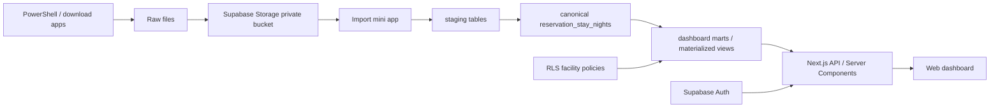
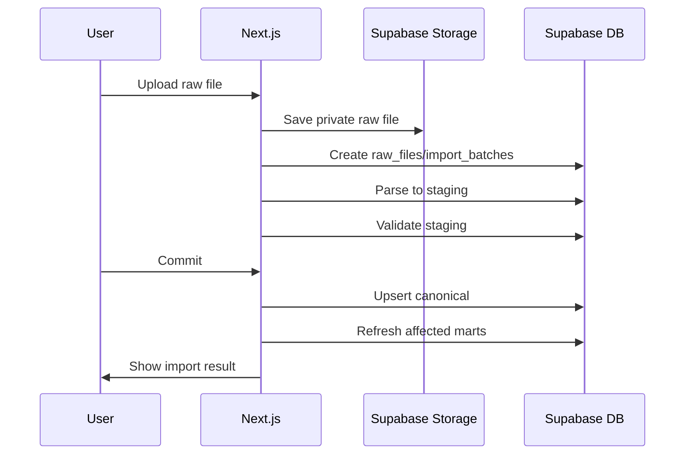

# トラベルコネクト Web ダッシュボード 詳細設計書

> 本ダッシュボードはトラベルコネクト（Travel-Connect）が契約施設向けに提供する。現状の実データはコルディオ（minpakuIN 経由）に限定だが、ねっぱん・手間いらずを使う契約施設も同等に分析できることを必須要件とする。

最終更新: 2026-06-15

## 1. 全体アーキテクチャ



### 1.1 採用技術

| 領域 | 技術 |
| --- | --- |
| Hosting | Vercel |
| Web | Next.js App Router |
| DB/Auth/Storage | Supabase |
| UI | Claude Design へ委任。実装側は component contract まで定義 |
| Batch/取得 | PowerShell、将来は GitHub Actions またはサーバーサイド worker |
| Validation | Python または Node.js による Excel/API 差分検証 |

### 1.2 設計方針

- raw ファイル、正規化データ、集計マートを分離する
- PMS 固有の処理は adapter に閉じ込める
- ダッシュボード API は集計済み mart のみを読む
- 施設別権限は Supabase RLS で DB レイヤーでも強制する
- 既存 Excel の数値再現を最優先し、UI 表現は後から差し替え可能にする

## 2. 推奨ディレクトリ構成

新規 Next.js アプリを作る場合の構成。

```text
webdashboard-app/
  app/
    (auth)/
    (dashboard)/
      dashboard/
        page.tsx
      imports/
        page.tsx
      admin/
        facilities/
        mappings/
    api/
      dashboard/
      imports/
  components/
    dashboard/
    imports/
    layout/
  lib/
    supabase/
    auth/
    adapters/
    aggregations/
    validation/
  scripts/
    powershell/
    validate-excel/
  supabase/
    migrations/
    seed/
  docs/
```

既存の `C:\dev\webdashboard-app` を使う場合は、この構成に合わせて不足部分を追加する。

## 3. Supabase スキーマ設計

### 3.1 schema

| schema | 用途 |
| --- | --- |
| `app` | 施設、ユーザー権限、マスタ |
| `ingest` | raw ファイル、取込バッチ、staging |
| `mart` | ダッシュボード用集計 |

### 3.2 マスタテーブル

#### `app.facilities`

| column | type | note |
| --- | --- | --- |
| `id` | uuid pk | 施設 ID |
| `facility_code` | text unique | 内部コード |
| `display_name` | text | 表示名 |
| `area_name` | text | 北谷/北部/那覇/沖縄市など |
| `is_active` | boolean | 有効/無効 |
| `created_at` | timestamptz | 作成日時 |

#### `app.source_facilities`

| column | type | note |
| --- | --- | --- |
| `id` | uuid pk | ソース施設 ID |
| `facility_id` | uuid fk | `app.facilities.id` |
| `source_system` | text | `minpakuin`, `neppan`, `temairazu` |
| `source_facility_code` | text | PMS 側施設コード |
| `source_facility_name` | text | PMS 側施設名 |
| `is_active` | boolean | 有効/無効 |

#### `app.profile_facilities`

| column | type | note |
| --- | --- | --- |
| `profile_id` | uuid | Supabase Auth user id |
| `facility_id` | uuid | 閲覧可能施設 |
| `role` | text | `admin`, `operator`, `viewer`, `facility_user` |

#### `app.room_inventory_months`

| column | type | note |
| --- | --- | --- |
| `facility_id` | uuid | 施設 |
| `month` | date | 月初日 |
| `sellable_rooms_per_day` | integer | 1日あたり販売可能室数 |
| `sellable_room_nights` | integer | 月の販売可能室泊数。通常 `sellable_rooms_per_day * 月日数` |

#### `app.budgets`

| column | type | note |
| --- | --- | --- |
| `facility_id` | uuid | 施設 |
| `month` | date | 月初日 |
| `budget_room_type` | text | 予算表用部屋タイプ |
| `budget_amount` | numeric | 予算売上 |
| `budget_room_nights` | integer | 予算室数 |

### 3.3 取込テーブル

#### `ingest.raw_files`

| column | type | note |
| --- | --- | --- |
| `id` | uuid pk | raw file id |
| `source_system` | text | 取込元 |
| `source_facility_code` | text | PMS 側施設コード |
| `storage_bucket` | text | Supabase Storage bucket |
| `storage_path` | text | raw ファイル path |
| `original_file_name` | text | 元ファイル名 |
| `content_hash` | text | 重複検知用 |
| `encoding` | text | `utf-8-sig`, `cp932` など |
| `uploaded_by` | uuid | auth user id |
| `uploaded_at` | timestamptz | upload 時刻 |

#### `ingest.import_batches`

| column | type | note |
| --- | --- | --- |
| `id` | uuid pk | batch id |
| `raw_file_id` | uuid fk | raw file |
| `status` | text | `uploaded`, `parsing`, `parsed`, `validating`, `validation_failed`, `validated`, `committing`, `committed`, `failed`, `cancelled` |
| `target_months` | date[] | 影響月 |
| `row_count_raw` | integer | raw 行数 |
| `row_count_canonical` | integer | canonical 件数 |
| `error_summary` | jsonb | エラー概要 |
| `created_at` | timestamptz | 作成日時 |
| `committed_at` | timestamptz | commit 時刻 |

#### `ingest.mapping_profiles`

| column | type | note |
| --- | --- | --- |
| `id` | uuid pk | mapping id |
| `source_system` | text | 対象ソース |
| `name` | text | mapping 名 |
| `version` | integer | version |
| `mapping_json` | jsonb | 列マッピング、変換ルール |
| `is_active` | boolean | 有効 mapping |

施設ID、source施設、部屋タイプ、経路、国籍、予算、販売可能室数、補正ルールの seed CSV 仕様は `docs/master-data-spec.md` を正とする。

### 3.4 canonical table

#### `app.reservation_stay_nights`

| column | type | note |
| --- | --- | --- |
| `id` | uuid pk | record id |
| `source_system` | text | `minpakuin`, `neppan`, `temairazu` |
| `current_record_key` | text | canonical 現在値 upsert key |
| `ingest_batch_id` | uuid | 取込 batch |
| `facility_id` | uuid | 施設 |
| `reservation_key` | text | 予約単位キー |
| `checkin_code` | text | チェックインコード |
| `ota_reservation_no` | text | OTA 予約番号 |
| `status` | text | raw status |
| `is_cancelled` | boolean | キャンセル判定 |
| `channel` | text | 予約経路 |
| `stay_date` | date | 部屋利用日 |
| `stay_month` | date | 部屋利用月 |
| `checkin_date` | date | チェックイン日 |
| `checkout_date` | date | チェックアウト日 |
| `booked_at` | timestamptz | 予約受付日時 |
| `room_type_raw` | text | raw 部屋タイプ |
| `room_type_normalized` | text | 正規化部屋タイプ |
| `budget_room_type` | text | 予算表用 |
| `room_no` | text | 部屋番号 |
| `nights` | integer | 泊数 |
| `stay_night_index` | integer | 何泊目か |
| `sold_room_nights` | numeric | 室数集計用。minpakuIN は 1 |
| `guest_count` | integer | 合計人数 |
| `adult_count` | integer | 大人人数 |
| `child_count` | integer | 子供人数 |
| `gross_amount` | numeric | 宿泊費/合計料金 |
| `tax_amount` | numeric | 消費税 |
| `net_amount` | numeric | 税抜 |
| `fee_adjusted_gross_amount` | numeric | 手数料補正後税込 |
| `fee_adjusted_tax_amount` | numeric | 手数料補正後税額 |
| `fee_adjusted_net_amount` | numeric | 手数料補正後税抜 |
| `fee_adjustment_rule_id` | uuid | 適用した補正ルール |
| `country_raw` | text | raw 国籍 |
| `country_normalized` | text | 正規化国籍 |
| `country_major` | text | 大分類 |
| `country_middle` | text | 中分類 |
| `is_stay_night` | boolean | チェックアウト日行除外後の宿泊行 |
| `lead_time_days` | integer | `stay_date - booked_at::date` |
| `is_valid_lead_time` | boolean | `booked_at` あり、かつ `lead_time_days >= 0` |
| `source_updated_at` | timestamptz | PMS 側更新日時 |
| `created_at` | timestamptz | 作成日時 |

### 3.5 index

```sql
create index on app.reservation_stay_nights (facility_id, stay_month);
create index on app.reservation_stay_nights (facility_id, stay_date);
create index on app.reservation_stay_nights (facility_id, channel, stay_month);
create index on app.reservation_stay_nights (facility_id, room_type_normalized, stay_month);
create index on app.reservation_stay_nights (facility_id, country_normalized, stay_month);
create unique index on app.reservation_stay_nights (source_system, current_record_key);
```

`stay_month` での月次 partition は、行数が増えてから導入する。初期は index と mart 差分更新で十分とする。

## 4. RLS 設計

### 4.1 方針

- `app.profile_facilities` に紐づく施設だけ閲覧可能
- `admin` は全施設閲覧可能
- 取込処理は server-side service role で実行し、クライアントへ service key を渡さない

### 4.2 helper function

```sql
create or replace function app.can_access_facility(target_facility_id uuid)
returns boolean
language sql
stable
security definer
as $$
  select exists (
    select 1
    from app.profile_facilities pf
    where pf.profile_id = auth.uid()
      and (
        pf.role = 'admin'
        or pf.facility_id = target_facility_id
      )
  );
$$;
```

### 4.3 policy example

```sql
alter table app.reservation_stay_nights enable row level security;

create policy "facility scoped select"
on app.reservation_stay_nights
for select
to authenticated
using (app.can_access_facility(facility_id));
```

mart table にも同じ `facility_id` ベースの RLS を設定する。

## 5. Adapter 設計

### 5.1 interface

```ts
export type SourceSystem = "minpakuin" | "neppan" | "temairazu";

export interface ImportAdapter {
  sourceSystem: SourceSystem;
  detect(input: RawFileContext): Promise<boolean>;
  parse(input: RawFileContext): Promise<ParsedSourceRows>;
  validate(rows: ParsedSourceRows): Promise<ValidationResult>;
  normalize(rows: ParsedSourceRows, context: NormalizeContext): Promise<CanonicalStayNight[]>;
}
```

### 5.2 `RawFileContext`

```ts
export interface RawFileContext {
  rawFileId: string;
  storagePath: string;
  originalFileName: string;
  sourceFacilityCode?: string;
  encoding?: "utf-8-sig" | "utf-8" | "cp932" | "shift_jis";
}
```

### 5.3 minpakuIN adapter

| raw column | canonical |
| --- | --- |
| `施設名` | `facility_id` へ mapping |
| `チェックインコード` | `checkin_code` |
| `OTA予約番号` | `ota_reservation_no`, `reservation_key` |
| `部屋利用日` | `stay_date`, `stay_month` |
| `部屋タイプ` | `room_type_raw`, `room_type_normalized` |
| `合計人数` | `guest_count` |
| `チェックアウト日` | `checkout_date` |
| `泊数` | `nights` |
| `予約受付日` | `booked_at` |
| `予約経路` | `channel` |
| `消費税` | `tax_amount` |
| `宿泊費` | `gross_amount` |
| `ステータス` | `status`, `is_cancelled` |
| `国` | `country_raw` |

変換ルール:

- `sold_room_nights = 1`
- `is_stay_night = stay_date != checkout_date`
- `is_cancelled = status == "キャンセル済み"`
- `reservation_key = ota_reservation_no`。空の場合は `checkin_code`
- Agoda/Trip.com 補正は canonical 作成時に `fee_adjusted_gross_amount`, `fee_adjusted_tax_amount`, `fee_adjusted_net_amount`, `fee_adjustment_rule_id` へ保存

### 5.4 手間いらず adapter

| raw column | canonical |
| --- | --- |
| `チェックイン日` | `checkin_date` |
| `チェックアウト日` | `checkout_date` |
| `部屋数` | `sold_room_nights` へ反映 |
| `泊数` | `nights` |
| `予約サイト名` | `channel` の第一候補 |
| `予約日時` | `booked_at` |
| `部屋名称` | `room_type_raw` |
| `合計料金` | `gross_amount` |
| `請求料金` | 補助金額 |
| `連泊情報` | 日別金額分解 |
| `予約区分` | `status`, `is_cancelled` |
| `備考` | 予約経路補助。例: `[海外]Agoda` |
| `部屋マスタ` | `room_type_normalized` 候補 |
| `詳細` | 日別・人数・部屋別金額分解 |

変換ルール:

- `encoding = cp932`
- `reservation_key` はファイル内に予約番号が無い場合、`source_facility_code + checkin_date + checkout_date + room_type + booked_at + gross_amount` の hash を使う
- `予約区分` が `キャンセル` を含む場合、`is_cancelled=true`
- `連泊情報` に日別金額がある場合は、宿泊日ごとの `gross_amount` に配賦する
- `連泊情報` が解析不能な場合は `合計料金 / 泊数` で均等配賦し、validation warning を出す
- `部屋数 > 1` の場合、`sold_room_nights = 部屋数` とする。物理展開はしない
- 人数は `大人人数 + 子供人数`

### 5.5 ねっぱん adapter

実サンプル `C:\dev\webdashboard-app\docs\コテージスターハウス今帰仁.csv` を確認済み。CP932、44列、15,807行。

| raw column | canonical |
| --- | --- |
| `予約ID` | `reservation_key` の構成要素 |
| `予約区分` | `status`, `is_cancelled` |
| `予約番号` | `ota_reservation_no`, `reservation_key` の構成要素 |
| `泊目` | `stay_night_index`, `stay_date` 算出 |
| `チェックイン日` | `checkin_date` |
| `チェックアウト日` | `checkout_date` |
| `申込日` | `booked_at` |
| `泊数` | `nights` |
| `予約サイト名称` | `channel` |
| `部屋タイプ名称` | `room_type_raw`, `room_type_normalized` |
| `室数` | `sold_room_nights` |
| `大人人数計` | `adult_count` |
| `子供人数計` | `child_count` |
| `幼児人数計` | `guest_count` に加算 |
| `料金合計額` | 予約総額。検算用 |
| `決済方法` | raw metadata |
| `大人合計額` | 泊目別金額 component |
| `子供合計額` | 泊目別金額 component |
| `幼児合計額` | 泊目別金額 component |
| `その他合計額` | 泊目別金額 component |
| `商品プランコード` | 検算・mapping 補助 |
| `更新日` | `source_updated_at` |

変換ルール:

- `encoding = cp932`
- `reservation_key = 予約ID + "|" + 予約番号`
- `current_record_key = source_system + facility + reservation_key + stay_date + room_type_raw + room_no + 泊目`
- `source_updated_at = 更新日`
- `stay_date = チェックイン日 + (泊目 - 1日)`
- `is_cancelled = 予約区分 == "キャンセル"`
- `予約区分 == "変更"` はキャンセル扱いにせず、通常予約と同じく集計対象にする。差分検証で既存レポートと異なる場合は別途ルール化する
- 同じ `reservation_key + 泊目` に複数行がある場合は、料金内訳行として 1 宿泊日に集約する
- 泊目別金額は `大人合計額 + 子供合計額 + 幼児合計額 + その他合計額`
- `料金合計額` は予約総額として検算に使い、泊目ごとに合算しない
- 泊目別金額合計と予約総額が一致しない予約は validation warning とする
- `sold_room_nights = 室数`
- `guest_count = 大人人数計 + 子供人数計 + 幼児人数計`
- ねっぱんの金額は税込。税率10%で `tax_amount` と `net_amount` を逆算する
- 初期端数処理は `tax_amount = floor(gross_amount * 10 / 110)`、`net_amount = gross_amount - tax_amount` とする。ねっぱんは手数料補正なしのため、初期値では `fee_adjusted_*` も同じ値にする。Excel差分検証で既存帳票と端数差が出る場合は `fee_adjustment_rules` で変更可能にする
- 国籍列が無いため、`country_raw/country_normalized = "不明"` とする
- raw の氏名、電話番号、住所、メールアドレス、会員番号は canonical に保存しない

取込時の staging、validation、再取込、冪等性、ねっぱんの料金内訳集約は `docs/import-processing-spec.md` を正とする。

## 6. 取込ミニアプリ設計

### 6.1 画面

| route | 内容 |
| --- | --- |
| `/imports` | 取込履歴、ステータス、エラー件数 |
| `/imports/new` | raw ファイルアップロード |
| `/imports/[batchId]/preview` | 列 mapping preview、変換前後比較 |
| `/imports/[batchId]/validate` | validation 結果 |
| `/imports/[batchId]/commit` | canonical 反映、mart 更新 |
| `/admin/mappings` | ソース別 mapping profile 編集 |

### 6.2 取込フロー



### 6.3 validation

| severity | 条件 | 挙動 |
| --- | --- | --- |
| error | 必須日付が無い | commit 不可 |
| error | 施設 mapping 不明 | commit 不可 |
| error | 金額が数値化できない | commit 不可 |
| warning | 国籍不明 | commit 可、`不明` に分類 |
| warning | 連泊情報を均等配賦 | commit 可 |
| warning | 予約番号が無く hash key 生成 | commit 可 |

staging table、validation issue、import batch 状態遷移は `docs/import-processing-spec.md` を正とする。

## 7. 集計 mart 設計

### 7.1 共通 filter

通常集計は以下を適用する。

```sql
where is_stay_night = true
  and is_cancelled = false
```

金額は画面の税表示に応じて以下を切り替える。

| 税表示 | 使用列 |
| --- | --- |
| 税込 | `fee_adjusted_gross_amount` |
| 税抜 | `fee_adjusted_net_amount` |

### 7.2 mart tables

#### `mart.daily_facility_metrics`

grain: `facility_id + stay_date`

| metric | definition |
| --- | --- |
| `sold_room_nights` | `sum(sold_room_nights)` |
| `guest_count` | `sum(guest_count)` |
| `gross_amount` | `sum(fee_adjusted_gross_amount)` |
| `tax_amount` | `sum(fee_adjusted_tax_amount)` |
| `net_amount` | `sum(fee_adjusted_net_amount)` |

稼働分析の月間/年間で使用する。

#### `mart.monthly_channel_metrics`

grain: `facility_id + stay_month + channel`

| metric | definition |
| --- | --- |
| `sold_room_nights` | `sum(sold_room_nights)` |
| `guest_count` | `sum(guest_count)` |
| `gross_amount` | `sum(fee_adjusted_gross_amount)` |
| `tax_amount` | `sum(fee_adjusted_tax_amount)` |
| `net_amount` | `sum(fee_adjusted_net_amount)` |

経路分析で使用する。

#### `mart.monthly_room_type_metrics`

grain: `facility_id + stay_month + room_type_normalized + budget_room_type`

| metric | definition |
| --- | --- |
| `sold_room_nights` | `sum(sold_room_nights)` |
| `guest_count` | `sum(guest_count)` |
| `reservation_count` | 予約×月単位の distinct count |
| `gross_amount` | `sum(fee_adjusted_gross_amount)` |
| `tax_amount` | `sum(fee_adjusted_tax_amount)` |
| `net_amount` | `sum(fee_adjusted_net_amount)` |

部屋タイプ別売上、販売室数、ADR で使用する。

#### `mart.monthly_country_metrics`

grain: `facility_id + stay_month + country_major + country_middle + country_normalized`

| metric | definition |
| --- | --- |
| `sold_room_nights` | `sum(sold_room_nights)` |
| `guest_count` | `sum(guest_count)` |
| `gross_amount` | `sum(fee_adjusted_gross_amount)` |
| `tax_amount` | `sum(fee_adjusted_tax_amount)` |
| `net_amount` | `sum(fee_adjusted_net_amount)` |
| `reservation_count` | 予約×月単位の distinct count |
| `multi_night_reservation_count` | 泊数 >= 2 の予約数 |
| `lead_time_total` | `is_valid_lead_time=true` の lead time 合計 |
| `lead_time_count` | `is_valid_lead_time=true` の対象予約数 |

#### `mart.stay_nights_distribution`

grain: `facility_id + checkin_month + room_type_normalized + nights_bucket`

| bucket | 条件 |
| --- | --- |
| `1` | `nights = 1` |
| `2` | `nights = 2` |
| `3_4` | `nights between 3 and 4` |
| `5_6` | `nights between 5 and 6` |
| `7_plus` | `nights >= 7` |

| metric | definition |
| --- | --- |
| `reservation_count` | 予約数 |
| `sold_room_nights` | 予約単位の室泊数合計 |
| `guest_count` | 予約単位の人数合計 |
| `gross_amount` | `sum(fee_adjusted_gross_amount)` |
| `tax_amount` | `sum(fee_adjusted_tax_amount)` |
| `net_amount` | `sum(fee_adjusted_net_amount)` |

予約単位に集約してから作成する。

#### `mart.booking_curve_monthly`

grain: `facility_id + stay_month + cancel_scope`

各 bucket 値は `is_valid_lead_time=true` かつ bucket 条件を満たす宿泊日の累積 `sum(sold_room_nights)` とする。予約件数・売上ではない。

| column | 条件 |
| --- | --- |
| `same_day` | `lead_time_days >= 0` |
| `one_day_before` | `lead_time_days >= 1` |
| `two_days_before` | `lead_time_days >= 2` |
| `three_to_six_days_before` | `lead_time_days >= 3` |
| `seven_to_thirteen_days_before` | `lead_time_days >= 7` |
| `fourteen_to_twenty_days_before` | `lead_time_days >= 14` |
| `twenty_one_to_thirty_days_before` | `lead_time_days >= 21` |
| `thirty_one_to_sixty_days_before` | `lead_time_days >= 31` |
| `sixty_one_to_ninety_days_before` | `lead_time_days >= 61` |
| `ninety_one_to_one_twenty_days_before` | `lead_time_days >= 91` |
| `one_twenty_one_to_one_fifty_days_before` | `lead_time_days >= 121` |
| `one_fifty_one_plus_days_before` | `lead_time_days >= 151` |

`cancel_scope` は `with_cancelled`, `without_cancelled`。

KPI定義、ADR/RevPAR/連泊率などの式、0除算、丸めは `docs/kpi-definitions.md` を正とする。

## 8. API 設計

API は Next.js route handler または server action で実装する。大量データの group by は行わず、mart/RPC を呼ぶ。

### 8.1 Dashboard API

| endpoint | 用途 |
| --- | --- |
| `GET /api/dashboard/occupancy` | 稼働分析 |
| `GET /api/dashboard/channels` | 経路分析 |
| `GET /api/dashboard/nationalities` | 国籍別分析 |
| `GET /api/dashboard/stay-nights` | 泊数分布 |
| `GET /api/dashboard/room-types` | 部屋タイプ別分析 |
| `GET /api/dashboard/annual-sales` | 全施設年間売上 |
| `GET /api/dashboard/booking-curve` | ブッキングカーブ |

共通 query:

| query | example |
| --- | --- |
| `facilityId` | uuid or `all` |
| `year` | `2026` |
| `month` | `6` |
| `period` | `monthly`, `yearly` |
| `taxMode` | `gross`, `net` |
| `compareWith` | `previous_year`, `budget`, `previous_snapshot` |

Response schema、error schema、endpoint別の返却型は `docs/api-contract.md` を正とする。

### 8.2 Import API

| endpoint | 用途 |
| --- | --- |
| `POST /api/imports/raw-files` | raw ファイル upload |
| `POST /api/imports/:batchId/parse` | staging 生成 |
| `POST /api/imports/:batchId/validate` | validation |
| `POST /api/imports/:batchId/commit` | canonical upsert + mart refresh |
| `GET /api/imports/:batchId` | 取込結果 |

## 9. UI コンポーネント設計

Claude Design に渡す前提で、情報設計と component contract を定義する。

### 9.1 ページ構成

| component | 役割 |
| --- | --- |
| `DashboardShell` | フィルタ、タブ、カードグリッド |
| `GlobalFilterBar` | 施設、年、月、税表示、比較対象 |
| `MetricCard` | KPI 表示 |
| `AnalysisCard` | 指標ごとの表示枠 |
| `PeriodTabs` | 月間/年間切替 |
| `ResponsiveDataTable` | 横長データの表示 |
| `TrendChart` | 月次/日次推移 |
| `RankingChart` | 経路/国籍/部屋タイプランキング |

### 9.2 7 指標カード

| card | tabs | primary content |
| --- | --- | --- |
| `OccupancyCard` | monthly/yearly | KPI + 日別/月別表 |
| `ChannelCard` | monthly/yearly | 経路別売上/構成比 |
| `NationalityCard` | yearly | 国籍別ランキング + 月別推移 |
| `StayNightsCard` | yearly | 泊数バケット |
| `RoomTypeCard` | yearly | 部屋タイプ別売上/室数/ADR |
| `AnnualSalesCard` | yearly | 施設/エリア別年間売上 |
| `BookingCurveCard` | monthly | リードタイム累積カーブ |

### 9.3 レスポンシブ

- mobile: 1 カラム、フィルタは折りたたみ
- tablet: 2 カラム、主要 KPI は横並び
- desktop: 12 column grid
- table はカード内横スクロールを許可
- グラフと表は同じ API response から生成し、再 fetch を避ける

## 10. PowerShell 連携設計

### 10.1 scripts

| script | 用途 |
| --- | --- |
| `scripts/powershell/fetch-neppan.ps1` | SharePoint のねっぱんフォルダから未取込ファイルを取得 |
| `scripts/powershell/upload-raw-file.ps1` | Supabase Storage へ raw file upload |
| `scripts/powershell/run-import.ps1` | upload 後に import API を呼び出す |

### 10.2 実行フロー

```powershell
.\fetch-neppan.ps1
.\upload-raw-file.ps1 -SourceSystem neppan -FacilityCode 8223 -Path .\raw\file.csv
.\run-import.ps1 -RawFileId "<uuid>"
```

認証情報は `.env.local` または Windows Credential Manager を使い、スクリプト内に直書きしない。

## 11. mart refresh 設計

### 11.1 差分更新

import commit 時に以下を抽出する。

- affected facility ids
- affected stay months
- affected checkin months

対象月だけ mart を削除/再作成する。

```sql
delete from mart.monthly_channel_metrics
where facility_id = any(:facility_ids)
  and stay_month = any(:months);

insert into mart.monthly_channel_metrics (...)
select ...
from app.reservation_stay_nights
where facility_id = any(:facility_ids)
  and stay_month = any(:months)
group by ...;
```

### 11.2 冪等性

canonical upsert は `source_system + current_record_key` の unique key で実施する。同じ raw ファイルを再取込しても重複しない。

source 側で予約状態が変わる場合は、同じ `reservation_key + stay_date + room_type` を後勝ち更新する。

`source_updated_at` は更新判定用の列として保持するが、unique key には含めない。詳細は `docs/import-processing-spec.md` を正とする。

## 12. Excel 差分検証設計

### 12.1 入力

| 入力 | 内容 |
| --- | --- |
| Excel | `コルディオレポートNEW.xlsm` |
| API/mart | Supabase から取得した同一条件の集計 |
| 条件 | 施設、対象年、対象月、税表示 |

### 12.2 検証 script

`scripts/validate-excel/compare-dashboard.ts` または Python で実装する。

処理:

1. Excel の対象シートを read only/data only で読む
2. シート別に比較範囲を定義する
3. API または mart から同じ粒度のデータを取得する
4. key 列で join する
5. 差分 CSV/Markdown を出力する

### 12.3 比較範囲

| dashboard | Excel sheet | 比較粒度 |
| --- | --- | --- |
| occupancy monthly | `稼働分析表(月間)` | 施設 + 日付 |
| occupancy yearly | `稼働分析表(年間)` | 施設 + 月 |
| channels monthly | `経路別分析表(月間)` | 施設 + 月 + 経路 |
| channels yearly | `①経路別分析表(年間)` | 月 + 経路 |
| nationality | `国籍別分析(NEW)` | 月 + 国籍分類 |
| stay nights | `泊数分布(NEW)(部屋タイプ別)` | 月 + 泊数バケット |
| room type | `部屋タイプ別分析(NEW) (全施設)` | 月 + 部屋タイプ |
| annual sales | `全施設年間売上` | 月 + 施設 |
| booking curve | `ブッキングカーブ` | 月 + リードタイム区分 |

## 13. 実装タスク分解

### D01 Supabase schema

作成物:

- `supabase/migrations/*_create_app_schema.sql`
- `supabase/migrations/*_create_ingest_schema.sql`
- `supabase/migrations/*_create_mart_schema.sql`
- staging tables migration
- `fee_adjustment_rules` migration
- `dashboard_snapshots` migration
- advisory lock または `ingest.import_locks` migration
- seed for facilities/sample mappings
- seed CSV import script

検証:

- `supabase db reset`
- RLS policy の select テスト

### D02 Canonical template package

作成物:

- `lib/adapters/types.ts`
- `lib/adapters/canonical-schema.ts`
- Zod schema
- fixture CSV

検証:

- schema parse test
- required field missing test

### D03 minpakuIN adapter

作成物:

- `lib/adapters/minpakuin.ts`
- `lib/adapters/minpakuin.test.ts`

検証:

- `base.csv` のヘッダーを読み取れる
- `sold_room_nights=1`
- Agoda/Trip.com 補正が現行 `create_report.py` と一致
- キャンセル除外が一致

### D04 temairazu adapter

作成物:

- `lib/adapters/temairazu.ts`
- `lib/adapters/temairazu.test.ts`

検証:

- CP932 を読める
- `連泊情報` から日別金額を抽出できる
- `予約区分=キャンセル` を `is_cancelled=true` にできる
- `部屋数` が `sold_room_nights` に反映される

### D05 neppan adapter

作成物:

- `lib/adapters/neppan.ts`
- `lib/adapters/neppan.test.ts`
- `fixtures/neppan/cottage-star-house-nakijin.sanitized.csv`

検証:

- CP932 を読める
- テスト fixture に氏名、電話番号、住所、メールアドレス、会員番号を含めない
- `予約ID + 予約番号 + 泊目` を宿泊日別 canonical に集約できる
- 大人/子供/幼児/その他の料金内訳行を二重計上せず合算できる
- `予約区分=キャンセル` を `is_cancelled=true` にできる
- `室数` が `sold_room_nights` に反映される
- PII列が canonical/API に出ない

### D06 import mini app

作成物:

- `/imports`
- `/imports/new`
- `/imports/[batchId]/preview`
- `/api/imports/*`

検証:

- raw upload
- preview
- validation error display
- commit

### D07 mart refresh

作成物:

- SQL functions or server actions for affected month refresh
- mart query tests

検証:

- affected month だけ再集計される
- 再取込しても重複しない

### D08 dashboard API

作成物:

- `/api/dashboard/occupancy`
- `/api/dashboard/channels`
- `/api/dashboard/nationalities`
- `/api/dashboard/stay-nights`
- `/api/dashboard/room-types`
- `/api/dashboard/annual-sales`
- `/api/dashboard/booking-curve`
- `docs/api-contract.md` の型に対応する Zod schema

検証:

- 権限がない施設は 403 または空結果
- mart の値と API response が一致
- `compareWith` ごとの response test
- `facilityId=all` の admin / non-admin test

### D09 dashboard UI

作成物:

- `DashboardShell`
- 7 indicator cards
- responsive layout
- loading/empty/error states

検証:

- 375px, 768px, 1440px で表示崩れなし
- 7 指標が表示される
- 月間/年間タブが切り替わる

### D10 PowerShell scripts

作成物:

- `fetch-neppan.ps1`
- `upload-raw-file.ps1`
- `run-import.ps1`

検証:

- credentials をログに出さない
- upload 後に `raw_files` record が作成される
- import batch が開始される

### D11 Excel validation

作成物:

- `scripts/validate-excel/compare-dashboard.ts`
- `docs/validation-report-template.md`

検証:

- Excel と mart/API の差分が出力される
- 差分 0 の場合に pass を返す

## 14. 未確定事項への実装時対応

| 未確定 | 実装時の扱い |
| --- | --- |
| ねっぱん国籍 | 国籍列が無いため初期は `不明`。別ファイルで取得できる場合は mapping を追加する |
| 予算/販売可能室数 | `docs/master-data-spec.md` の seed CSV で投入する |
| ログイン方式 | Supabase email/password を初期値にし、後で magic link に差し替え可能にする |
| 手間いらず予約番号 | 無い場合は hash key。後日正式予約番号列があれば mapping 更新 |
| 税補正 | `fee_adjustment_rules` table 化し、コード直書きを避ける |

## 15. 参考リンク

- [Supabase Storage](https://supabase.com/docs/guides/storage)
- [Supabase Row Level Security](https://supabase.com/docs/guides/database/postgres/row-level-security)
- [Vercel Functions duration](https://vercel.com/docs/functions/configuring-functions/duration)
- [Vercel Functions limitations](https://vercel.com/docs/functions/limitations)
